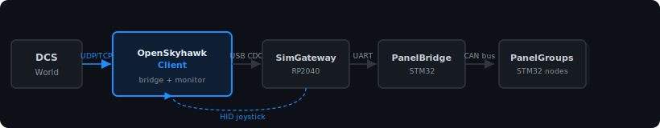

# OpenSkyhawk Client

Cross-platform (Windows + macOS) desktop app that connects the **OpenSkyhawk** A-4E
home cockpit to DCS — replacing the console-only `connect-serial-port.cmd` / `socat`
relay with a single GUI that **is the bridge and the monitor**.

It auto-detects the SimGateway, relays the DCS-BIOS stream both ways, and surfaces
live connection status, decoded DCS-BIOS log, sim telemetry, full HID status, and
raw serial monitoring. **v0.1.0** is released with Windows and macOS installers.

Download: [GitHub Releases](https://github.com/OpenSkyHawk/SkyHawkClient/releases)

## How it fits the OpenSkyhawk stack



## Source modes

| Mode        | What it does                                                      |
| ----------- | ----------------------------------------------------------------- |
| **Bridge**  | SimGateway serial ↔ DCS-BIOS + HID. Full relay, replaces `socat`. |
| **Monitor** | DCS-BIOS off the LAN, no device. Inspect/test without hardware.   |
| **Replay**  | Feed a recorded capture into the parser with no DCS running.      |

## Features

- Auto-detects SimGateway by USB VID/PID (`0x2E8A / 0x4134`) + CDC class
- Bidirectional DCS-BIOS relay (local multicast, TCP to remote DCS, or unicast)
- Live decoded DCS-BIOS log — filter, pause, export TSV, raw ↔ named toggle
- Sim telemetry gauges: RPM, IAS (kt), Flap, Press Alt (ft), Fuel
- Full HID status: 8 axes, 128 buttons, 4 hat switches
- Raw serial TX/RX hex monitor (Bridge mode)
- Record live sessions to `.json`; replay on any machine with no DCS
- Connected PanelGroup node roster (Bridge mode, firmware flag required)
- Auto-reconnect on unplug; config persisted to `userData`

## Remote DCS (SimGateway here, DCS on another PC)

DCS-BIOS binds port **7778 on all interfaces** by default. Point the client at
`tcp://<DCS-IP>:7778` — no script on the DCS host, just open Windows Firewall for
inbound TCP 7778. The export multicast `239.255.50.10:5010` is loopback-only, so TCP
is the remote transport. See [PRD §4](./PRD.md) for the full picture.

## Develop

```bash
npm install      # Node 24+
npm run dev      # launch the app (electron-vite)
npm test         # vitest unit tests
npm run lint
npm run build    # typecheck + bundle
npm run sync     # regenerate reference files from pinned OpenSkyhawk commit
```

## Sync script

`scripts/sync-a4ec.ts` (`npm run sync`) sparse-fetches a **pinned OpenSkyhawk commit**
and regenerates `src/main/reference/*.generated.ts` — the A-4E-C control map, HID layout,
and SimGateway constants. Generated files are committed so normal builds need no network.
CI runs a freshness check on every PR.

## License

Copyright (c) 2026 OpenSkyHawk.

**GPL-2.0-only** — see [LICENSE](./LICENSE). Matches the firmware; Bort (GPL-3) is a
pattern reference only — no source copied.
